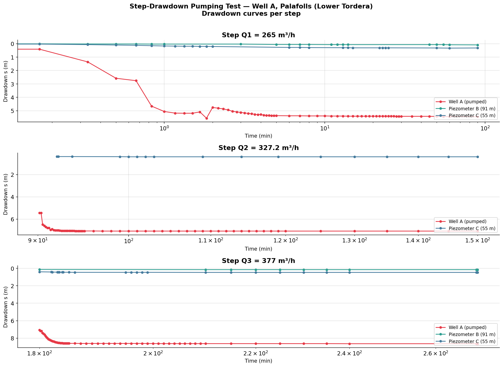
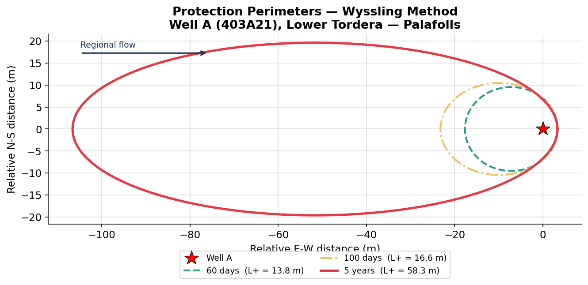

# Tordera-Palafolls Water Intakes — Hydrogeological Analysis (Catalonia)

> **Step-drawdown pumping test · Cooper-Jacob method · Well efficiency · Wyssling protection perimeters** > Academic Project — M.Sc. Science and Integrated Water Management, Universitat de Barcelona (2024–2026)

---

## Project Description

This project was developed as part of the **Master's degree in Science and Integrated Water Management** at the Universitat de Barcelona. Its main objective is to design a **sustainable water supply strategy** for the municipalities of **La Tordera** and **Palafolls** (Maresme region, Catalunya).

Given that using the Tordera River directly as a primary supply source is **unfeasible** (due to a low average annual flow of 1.10 m³/s, high seasonal irregularity, and wastewater contamination), the project focuses on **designing a groundwater extraction system** within the **deep fluviodeltaic aquifer of the lower Tordera (Code: 403A21)**.

The comprehensive analysis includes:

1. **Step-Drawdown Pumping Test** — Interpretation of 3 discharge steps (265, 327, and 377 m³/h) with synchronized drawdown measurements across 3 observation points.
2. **Cooper-Jacob Method** — Estimation of aquifer Transmissivity (T) and Storage Coefficient (S) derived from drawdown-time curves.
3. **Well Efficiency (Jacob, 1947)** — Separation of linear and non-linear well losses to evaluate the structural and hydraulic efficiency of the well.
4. **Protection Perimeters (Wyssling Method)** — Delineation of capture zones and sanitary protection boundaries for time horizons of 60 days, 100 days, and 5 years.

---

## Main Results

| Parameter | Value |
|-----------|-------|
| Transmissivity (T) | ~8,686 m²/day |
| Hydraulic Conductivity (K) | ~668 m/day |
| Regional Hydraulic Gradient (i) | 0.003 |
| Design Extraction Flow Rate | 1,080 m³/day |
| Stagnation Point Distance (X₀) | ~6.6 m |

**Protection Perimeters (Wyssling Method):**

| Time Horizon | Upstream Extension (L+) | Downstream Extension (L-) | Maximum Width (B) |
|--------------|-------------------------|---------------------------|-------------------|
| 60 days      | 13.8 m                  | 7.2 m                     | 19.1 m            |
| 100 days     | 16.6 m                  | 10.0 m                    | 20.9 m            |
| 5 years      | 58.3 m                  | 51.7 m                    | 39.2 m            |

**Regulatory Protection Zones (defined from perimeter results):**

| Zone | Extent | Restrictions |
|------|--------|---------------|
| Immediate (black) | 2 m | Well maintenance and cleaning only |
| Proximate (green) | 20 m | No industrial activity, discharge points, or soil-disturbing works |
| Remote (violet) | 30 m | No persistent/toxic substances; no aquifer-flow alterations |
| Enveloping (blue) | 80 m | No storage/production/discharge of highly persistent contaminants |

## Data Visualizations


*Semilogarithmic drawdown-time curves per pumping step*


*Cooper-Jacob straight-line alignment — T & S estimation*


*Well efficiency and head loss analysis (Jacob's method)*


*Sanitary protection zones — Wyssling Method mapping*

```
Tordera-Palafolls_Water_Intakes/
│
├── Docs/
│   └── Informe_Final_Captaciones_Tordera-Palafolls.pdf
├── data/
│   └── palafolls_pouA.csv
├── output/
│   ├── 01_Drawdrown_curve.png
│   ├── 02_cooper_jacob.png
│   ├── 03_Efficiency_analysis.png
│   └── 04_Perimeters_wyssling.png
├── analisis_hidrogeologico_palafolls.ipynb
└── README.md
```
## How to Run the Analysis

```bash
pip install pandas numpy matplotlib scipy
jupyter notebook analisis_hidrogeologico_palafolls.ipynb
```

---

## Stack técnico


---

## Geological Context

The **Baix Tordera alluvial aquifer** is an unconfined-to-confined groundwater system composed of Quaternary deposits of gravel, sand, and silt from the lower reaches of the Tordera River. It displays high permeability and features strong hydraulic connectivity with both the surface river network and, in certain littoral sectors, the Mediterranean Sea.

While its exceptionally high transmissivity values (>5,000 m²/day) render it a vital strategic resource for regional development, they also increase its vulnerability to anthropogenic pollution. This high vulnerability highlights the critical importance of accurately delineating groundwater capture zones and protection perimeters.

---

## Authors

**Carlos Daniel Muñoz Sánchez**  
- Geologist · Hydrogeologist · GIS & Data Analyst 
- M.Sc. Science and Integrated Water Management — Universitat de Barcelona  
[LinkedIn](https://www.linkedin.com/in/danielmu95/) · [GitHub](https://github.com/cdmunozs)

**Lorena Larrotta Morales**  
- Geologist · Hydrogeologist 
- M.Sc. Science and Integrated Water Management — Universitat de Barcelona  
[LinkedIn](https://www.linkedin.com/in/lorena-larrotta-morales-202098/) 

**Yomery Mercedes**  
- Chemical Engineer · Laboratory Analyst · Quality Control · Physicochemical & Microbiological Analysis 
- M.Sc. Science and Integrated Water Management — Universitat de Barcelona  
[LinkedIn](https://www.linkedin.com/in/yomery-mercedes-m-ab50651b5/) 

---

## References

- Cooper, H.H. & Jacob, C.E. (1946). A generalized graphical method for evaluating formation constants. *Trans. Am. Geophys. Union*, 27(4).
- Jacob, C.E. (1947). Drawdown test to determine effective radius of artesian well. *Trans. ASCE*, 112.
- Wyssling, L. (1979). Die Grundwasserschutzzonen der Wasserversorgungen. SVGW, Zürich.
- ACA — Agència Catalana de l'Aigua. Sistema d'Informació del Medi Natural (SIMAN).
