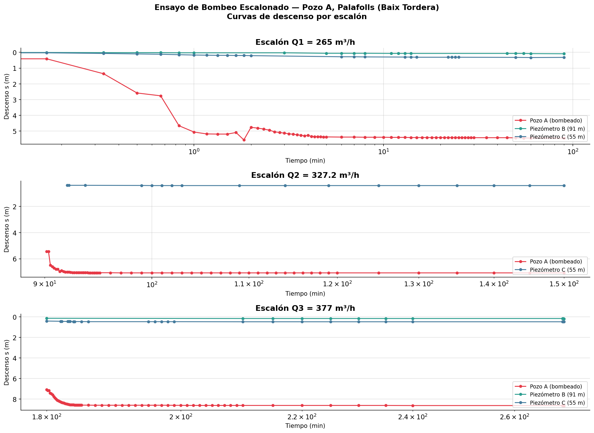
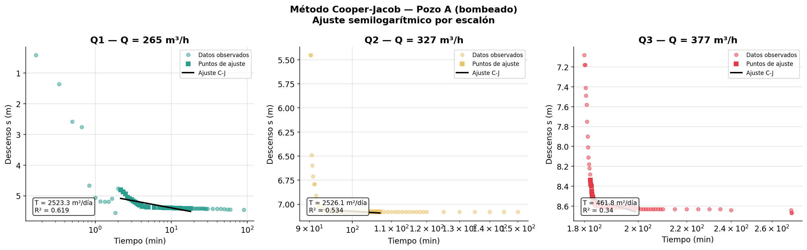
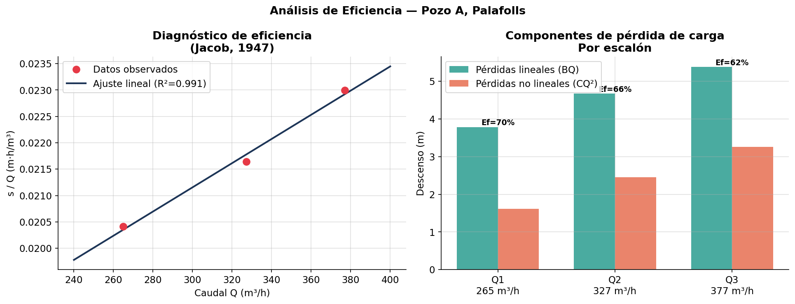
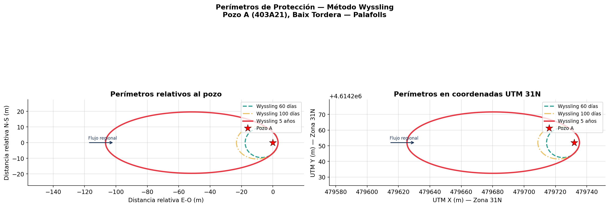

# Captaciones Tordera — Análisis Hidrogeológico (Palafolls, Catalunya)

> **Ensayo de bombeo escalonado · Cooper-Jacob · Eficiencia de pozo · Perímetros de protección Wyssling**  
> Proyecto académico — M.Sc. Ciencia y Gestión Integral del Agua, Universitat de Barcelona (2024–2026)

---

## Descripción del proyecto

El presente trabajo forma parte del **Máster en Ciencia y Gestión Integral del Agua** de la Universitat de Barcelona y tiene como objetivo proponer una **estrategia sostenible de abastecimiento hídrico** para los municipios de **La Tordera** y **Palafolls** (comarca del Maresme, Barcelona).

Dada la **inviabilidad del uso directo del río Tordera** como fuente principal de abastecimiento (bajo caudal medio anual de 1,10 m³/s, alta irregularidad estacional y contaminación por vertidos), se optó por el **diseño de una captación subterránea** en el **acuífero fluviodeltaico profundo de la baja Tordera (código 403A21)**.

El análisis incluye:

1. **Ensayo de bombeo escalonado** — Interpretación de 3 escalones de caudal (265, 327 y 377 m³/h) con medición sincronizada en 3 puntos de observación.
2. **Método Cooper-Jacob** — Estimación de transmisividad (T) y coeficiente de almacenamiento (S) a partir de las curvas de descenso.
3. **Eficiencia del pozo (Jacob, 1947)** — Separación de pérdidas lineales y no lineales para evaluar el estado constructivo del pozo.
4. **Perímetros de protección (Wyssling)** — Delimitación de zonas de captura para horizontes de 60 días, 100 días y 5 años.

---

## Resultados principales

| Parámetro | Valor |
|-----------|-------|
| Transmisividad (T) | ~8.686 m²/día |
| Conductividad hidráulica (K) | ~668 m/día |
| Gradiente hidráulico regional (i) | 0.003 |
| Caudal concesional de diseño | 1.080 m³/día |
| Radio de llamada (X₀) | ~18.800 m |

**Perímetros de protección (Wyssling):**

| Horizonte | Extensión aguas arriba (L+) | Extensión aguas abajo (L-) | Ancho máximo (B) |
|-----------|--------------------------|--------------------------|--------------------|
| 60 días   | ~500 m | ~50 m | ~310 m |
| 100 días  | ~700 m | ~80 m | ~410 m |
| 5 años    | ~1.800 m | ~400 m | ~830 m |

## Visualizaciones


*Curvas de descenso semilogarítmicas por escalón*


*Ajuste Cooper-Jacob — estimación de T*


*Análisis de eficiencia del pozo (Jacob)*


*Perímetros de protección — Método Wyssling*

```
captaciones_tordera/
│
├── data/
│   └── palafolls_pouA.csv
├── output/
│   ├── 01_curvas_descenso.png
│   ├── 02_cooper_jacob.png
│   ├── 03_eficiencia_pozo.png
│   └── 04_perimetros_wyssling.png
├── analisis_hidrogeologico_palafolls.ipynb
└── README.md
```
## Cómo ejecutar el análisis

```bash
pip install pandas numpy matplotlib scipy
jupyter notebook analisis_hidrogeologico_palafolls.ipynb
```

---

## Stack técnico


---

## Contexto geológico

El **acuífero aluvial del Baix Tordera** es un sistema de acuífero libre-confinado formado por depósitos cuaternarios de gravas, arenas y limos del río Tordera en su tramo bajo. Presenta alta permeabilidad y está hidráulicamente conectado con el río y, en algunos sectores, con el mar Mediterráneo.

Los elevados valores de transmisividad (>5.000 m²/día) lo convierten en un recurso estratégico, pero también lo hacen vulnerable a la contaminación, de ahí la importancia de delimitar correctamente los perímetros de protección.

---

## Autores

**Carlos Daniel Muñoz Sánchez**  
Geólogo · Hidrogeólogo · GIS & Data Analyst 
M.Sc. Ciencia y Gestión Integral del Agua — Universitat de Barcelona  
[LinkedIn](https://www.linkedin.com/in/danielmu95/) · [GitHub](https://github.com/cdmunozs)

**Lorena Larrotta Morales**  
Geóloga · Hidrogeóloga
M.Sc. Ciencia y Gestión Integral del Agua — Universitat de Barcelona  
[LinkedIn](https://www.linkedin.com/in/lorena-larrotta-morales-202098/) 

**Yomery Mercedes**  
Ingeniera Química · Analista de Laboratorio · Control de Calidad· Análisis fisicoquímico y Microbiológico
M.Sc. Ciencia y Gestión Integral del Agua — Universitat de Barcelona  
[LinkedIn](https://www.linkedin.com/in/yomery-mercedes-m-ab50651b5/) 

---

## Referencias

- Cooper, H.H. & Jacob, C.E. (1946). A generalized graphical method for evaluating formation constants. *Trans. Am. Geophys. Union*, 27(4).
- Jacob, C.E. (1947). Drawdown test to determine effective radius of artesian well. *Trans. ASCE*, 112.
- Wyssling, L. (1979). Die Grundwasserschutzzonen der Wasserversorgungen. SVGW, Zürich.
- ACA — Agència Catalana de l'Aigua. Sistema d'Informació del Medi Natural (SIMAN).
